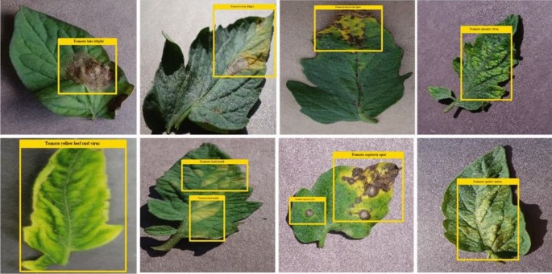

  

# 🍅 Tomato Leaf Disease Detection using YOLO Models

This project applies object detection models (YOLOv5, YOLOv8, YOLOv12) to detect **diseases on tomato leaves** in real-world agricultural conditions, especially focused on Vietnamese crops.

---

## 📁 Dataset

We use a labeled dataset in YOLO format, suitable for training modern object detectors.

🔗 **[View Dataset on Kaggle](https://www.kaggle.com/datasets/aresusayhi/vietnameses-tomato-disease-dataset)**

---

## 🩺 Disease Classes

| Class | Description |
|-------|-------------|
| **Healthy** | Healthy tomato leaf with no visible issues. |
| **Early Blight** | Dark brown spots with concentric rings. |
| **Late Blight** | Wilted, blackened leaves with rapid spread. |
| **Leaf Miner** | White squiggly trails caused by insect larvae. |
| **Leaf Mold** | Yellow/gray mold under leaves causing defoliation. |
| **Mosaic Virus** | Mottled yellow-green leaves, stunted growth. |
| **Septoria** | Small gray circular spots with dark margins. |
| **Spider Mites** | Tiny specks, leaf curling and drying. |
| **Yellow Leaf Curl Virus** | Yellowing and curling leaves, reduced yield. |

---

## 🚀 Training Notebooks

| Model | Notebook | Open |
|-------|----------|------|
| YOLOv12 | [Train Yolov12 with dataset Tomato disease leaves and results](https://www.kaggle.com/code/aresusayhi/train-yolov12-tomato-disease-leaves-detect) |  |

---

## 🎯 Project Goals

- Compare detection accuracy, model size, and inference speed
- Identify the most suitable model for edge deployment (e.g. drones, smartphones, smart farms)

---

## ⚙️ How to Use

1. Download the dataset from [Kaggle](https://www.kaggle.com/datasets/aresusayhi/vietnameses-tomato-disease-dataset)
2. Run your preferred training notebook (on Kaggle or locally)
3. Evaluate detection performance across YOLO versions

---

## 🤝 Contributing

Contributions are welcome!  
Feel free to open a pull request to improve models, add new benchmarks, or refine post-processing.

---

## 👨‍💻 Author

- **Aresu**  
- 🔗 [Kaggle Profile](https://www.kaggle.com/aresusayhi)
